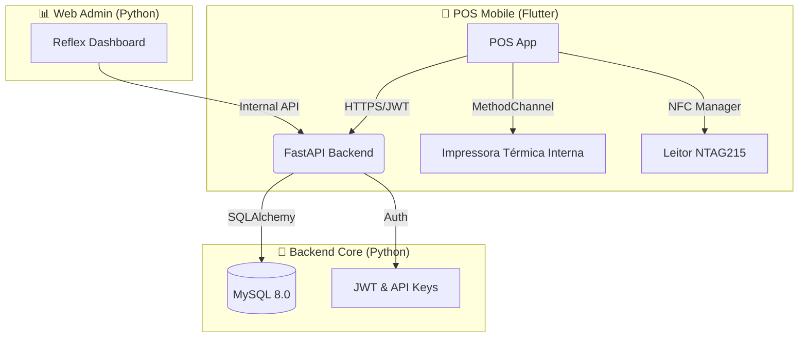

# ⭐ SYSTEM MASTER PLAN: Paysafe POS (FastAPI + Reflex + Flutter)

> **Versão:** Final release candidate specification.
> **Objetivo:** Sistema POS de classe mundial para hardware Android (H10P/Sunmi), com backend de alta performance e dashboard administrativo 100% Python.

---

# 1. 🎯 Stack Tecnológica & Arquitetura

O sistema foi desenhado para eliminar complexidade desnecessária (como duplicidade JS/Python) e focar em performance nativa.

## 🧱 Arquitetura de Alto Nível



## �️ Tecnologias Escolhidas

### **Backend: FastAPI (Python 3.11+)**
*   **Por que?** Mais rápido que Flask, validação de dados automática (Pydantic) e documentação OpenAPI nativa.
*   **ORM:** SQLAlchemy 2.0 (Async) + Alembic (Migrations).
*   **Driver BD:** `aiomysql` ou `asyncmy`.

### **Dashboard: Reflex (Python)**
*   **Por que?** Permite criar SPAs complexas usando apenas Python. Elimina a necessidade de gerir uma stack Node.js/React separada.
*   **Auth:** Sessão baseada em cookies seguros (`HttpOnly`).

### **Mobile: Flutter (Dart)**
*   **Por que?** Performance nativa, excelente gestão de memória em dispositivos low-end (POS) e facilidade de integração via Platform Channels.

---

# 2. 🗂️ Estrutura do Repositório

Organização obrigatória para garantir "Clean Architecture":

```text
/paysafe-system
│
├── backend-api/                # 🚀 FastAPI Project
│   ├── app/
│   │   ├── models/            # SQLAlchemy Models
│   │   ├── schemas/           # Pydantic Schemas (Request/Response)
│   │   ├── routers/           # API Endpoints (v1/)
│   │   ├── services/          # Business Logic & Auth
│   │   └── database.py        # Configuração DB Async
│   ├── alembic/               # Database Migrations
│   └── main.py                # App Entrypoint
│
├── web-dashboard/              # 📊 Reflex Project
│   ├── pages/                 # UI Pages (Login, Dashboard, Merchants)
│   ├── components/            # Widgets Reutilizáveis (Table, Sidebar)
│   └── rxconfig.py            # Reflex Config
│
├── mobile-pos/                 # 📱 Flutter Project
│   ├── lib/
│   │   ├── screens/           # UI (Login, Venda, Histórico)
│   │   ├── services/          # API Client & Hardware Drivers
│   │   ├── providers/         # State Management (Provider/Riverpod)
│   │   └── widgets/
│   └── android/               # Native Android Code (Kotlin - POS Driver)
│
├── docker/                     # 🐳 Infraestrutura
│   └── docker-compose.yml     # Orchestration
│
└── README.md
```

---

# 3. 🔥 Funcionalidades Core (CRUD & Regras)

### 1. Cobradores (Agents)
*   **Dados:** `id`, `user_id` (fk), `cpf`, `status`.
*   **Regras:** Um agente pode ter múltiplos POS atribuídos. Ações são logadas na auditoria.

### 2. Supermercados (Merchants)
*   **Dados:** `legal_name`, `tax_id` (NUIT), `tax_rate` (%), `commission_rate`.
*   **Regras:** Configura se o imposto é incluso ou somado. Possui contas bancárias/M-Pesa para settlement.

### 3. POS Devices (Hardware)
*   **Dados:** `serial_number`, `model`, `api_key_hash`, `status` (Online/Offline), `last_seen`.
*   **Segurança:** Autenticam-se via header `X-Device-Token`. O token é gerado no admin e inserido uma vez no dispositivo.

### 4. Transações
*   **Dados:** `amount`, `payment_method` (M-Pesa/Cash/Card), `nfc_uid`, `status`.
*   **Fluxo:**
    1.  App lê NFC.
    2.  Envia para API.
    3.  API processa e retorna `receipt_data`.
    4.  App imprime recibo.

### 5. Auditoria & Segurança
*   **Audit Log:** Tabela imutável registrando `actor_id`, `action`, `resource`, `json_diff`, `ip`.
*   **Senhas:** Hash obrigatório (Argon2 ou Bcrypt).

---

# 4. 📟 Guia de Hardware POS (H10P/Sunmi)

> **Critico:** O Flutter DEVE acessar o hardware nativo para funcionar. Não usar drivers genéricos.

## 🖨️ Impressão Térmica (Internal Printer)

O backend gera o layout lógico (JSON), o Flutter formata para o hardware.

**Fluxo de Implementação:**

1.  **Flutter (Dart side):**
    ```dart
    const platform = MethodChannel('com.paysafe.pos/printer');
    // Envia texto ou comandos ESC/POS
    await platform.invokeMethod('print', {'text': "RECIBO PAYSAFE\nValor: 500 MZN"});
    ```

2.  **Android (Kotlin side - MainActivity.kt):**
    Use o SDK do fabricante (Sunmi/Xprinter) para interceptar a chamada.
    ```kotlin
    MethodChannel(flutterEngine.dartExecutor, "com.paysafe.pos/printer")
        .setMethodCallHandler { call, result ->
            if (call.method == "print") {
                val text = call.argument<String>("text")
                PrinterService.printString(text) // SDK Nativo
                result.success(null)
            }
        }
    ```

## � Leitura NFC (NTAG215)
*   Package: `nfc_manager`.
*   Ação: Ao detectar tag, converter UID para Hex String e preencher campo de cliente na venda.

## 💾 Modo Offline
*   Storage: `Hive` ou `SQFlite` no app.
*   Sync: `WorkManager` para enviar vendas pendentes quando recuperar internet.

---

# 5. 🚀 Setup "Zero to Hero"

### Variáveis de Ambiente (`.env`)
```env
# Backend
DATABASE_URL=mysql+aiomysql://paysafe:secret123@db/paysafe
SECRET_KEY=generate_secure_random_string
ALGORITHM=HS256

# Reflex
REFLEX_ENV=dev
```

### Rodando com Docker (Recomendado)
```bash
# 1. Build e Start
docker-compose up -d --build

# 2. Rodar Migrations
docker-compose exec backend alembic upgrade head

# 3. Acessar
# Admin: http://localhost:3000
# API Doc: http://localhost:8000/docs
```

### Rodando Manualmente (Dev)

**Backend:**
```bash
cd backend-api
pip install -r requirements.txt
uvicorn app.main:app --reload
```

**Web Admin:**
```bash
cd web-dashboard
pip install reflex
reflex init
reflex run
```

**Mobile:**
```bash
cd mobile-pos
flutter pub get
flutter run
```

---

# 6. 🧠 Instruções de Manutenção

*   **Evite:** Misturar lógica de negócio no Flutter. O App deve ser "burro" (apenas UI e Hardware), toda a inteligência fica no FastAPI.
*   **Segurança:** Nunca comite `.env` ou chaves de API.
*   **Logs:** Monitore `docker logs backend` para ver erros estruturados.

---

**Licença:** Proprietário.
