# Arquitetura do Frontend PaySafe

Este documento descreve a arquitetura técnica do frontend Next.js do sistema PaySafe.

---

## 🏗️ Diagrama de Alto Nível

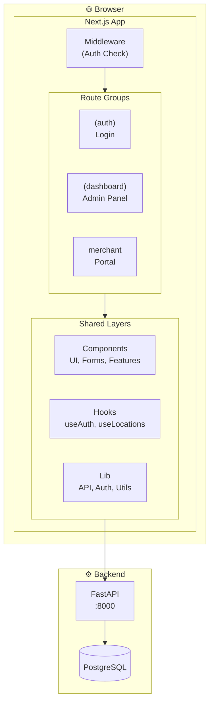

---

## 📂 Estrutura de Camadas

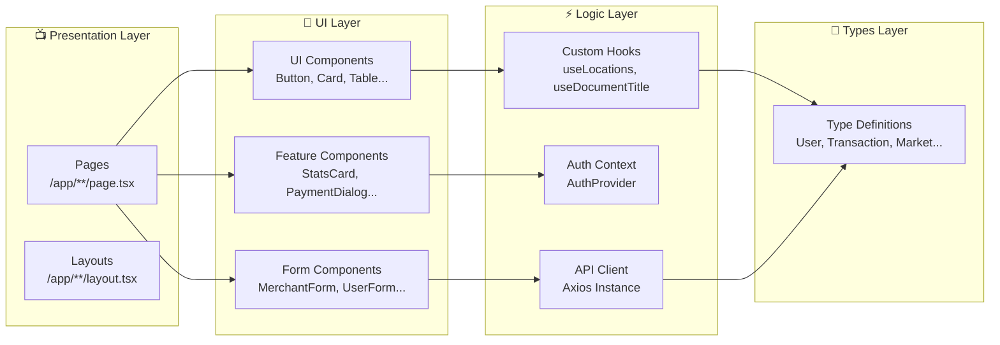

---

## 🗂️ Estrutura de Rotas (App Router)

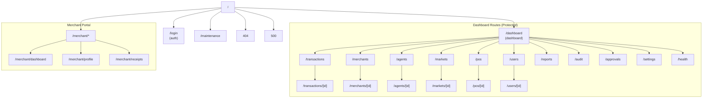

---

## 🔐 Fluxo de Autenticação

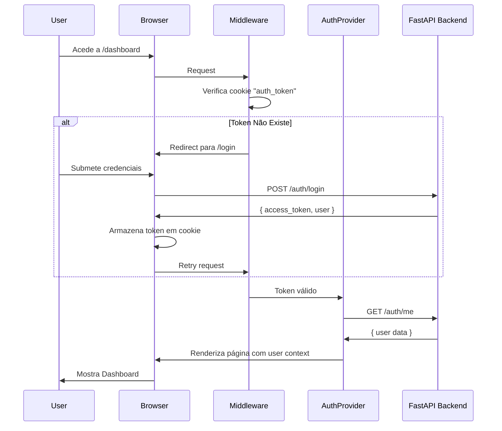

---

## 🎨 Hierarquia de Componentes

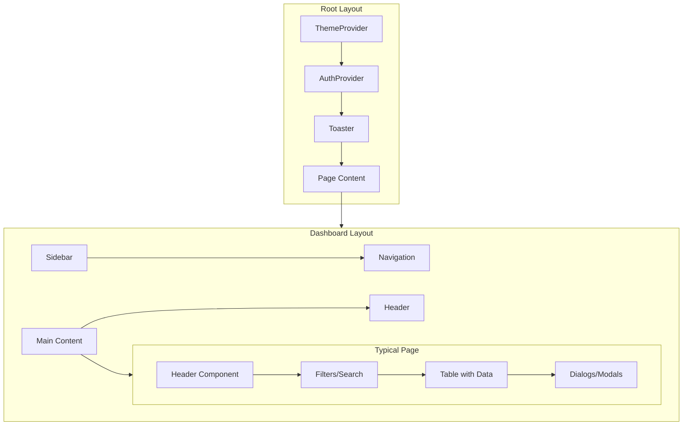

---

## 📊 Componentes UI (Radix UI Base)

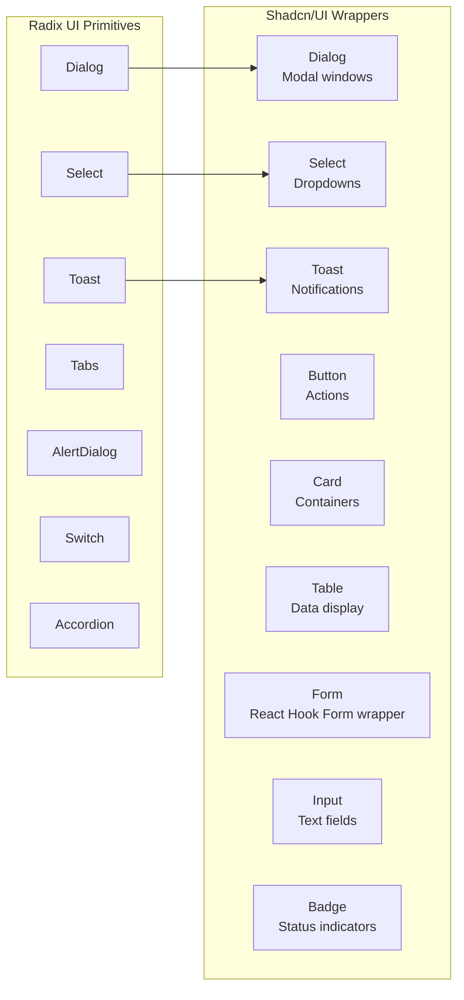

---

## 🔄 Fluxo de Dados

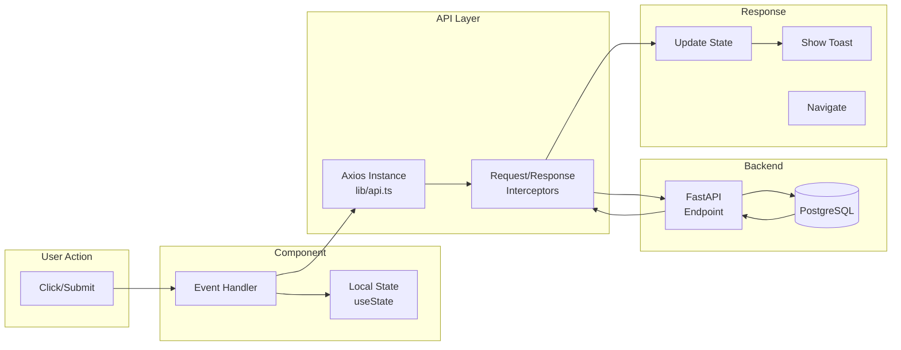

---

## 🗃️ Gestão de Estado

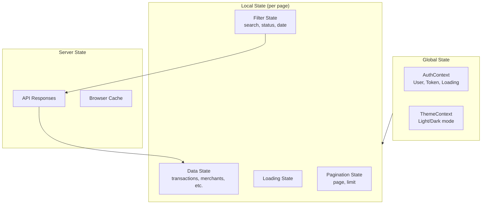

---

## 📱 Responsividade

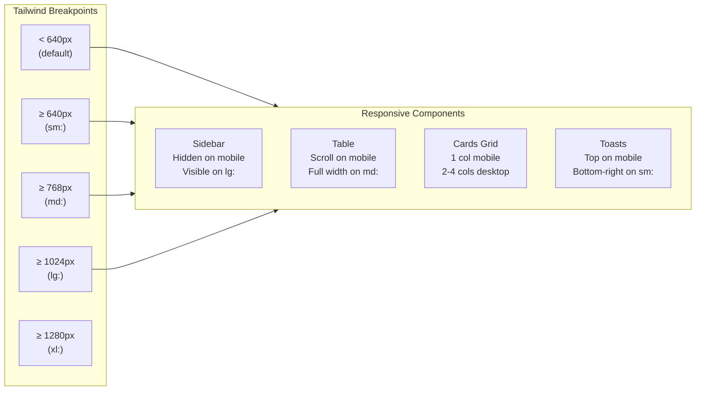

---

## 🔒 Controlo de Acesso por Role

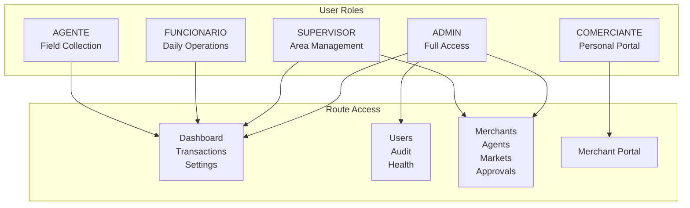

---

## 🌐 Comunicação com Backend

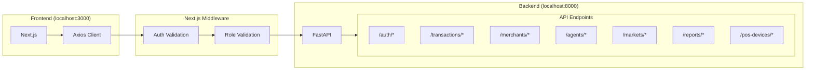

---

## 📈 Diagrama de Dependências

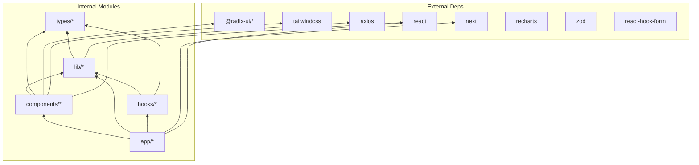

---

## 📋 Resumo da Arquitetura

| Aspecto | Tecnologia/Padrão |
|---------|-------------------|
| **Framework** | Next.js 16 (App Router) |
| **UI Components** | Radix UI + Shadcn/UI |
| **Styling** | Tailwind CSS 4 |
| **State Management** | React Context + Local State |
| **Forms** | React Hook Form + Zod |
| **HTTP Client** | Axios com interceptors |
| **Auth** | JWT via cookies + Context |
| **Charts** | Recharts |
| **Icons** | Lucide React |
| **Animations** | Framer Motion |

---

*Última atualização: 2025-12-26*
